# ffmpegOut  
by rigaya  

ffmpegOut は、[ffmpeg](https://ffmpeg.org/)を使用してエンコードを行うAviutlの出力プラグインです。

## ダウンロード & 更新履歴
[こちら＞＞](https://github.com/rigaya/ffmpegOut/releases)

## 想定動作環境
Windows 10/11 (x86/x64)  
Aviutl 1.00 以降 推奨

## ffmpegOut 使用にあたっての注意事項
無保証です。自己責任で使用してください。  
ffmpegOutを使用したことによる、いかなる損害・トラブルについても責任を負いません。  

## ffmpegOut の AviUtl2 への導入・更新

> [!IMPORTANT]
> AviUtl(無印) 向けには、後述の[AviUtl (無印) への導入・更新](#ffmpegOut-の-aviutl-無印-への導入・更新)をご覧ください。

### ダウンロード

まず、AviUtl**2**_ffmpegOut_x.xx_install.exe を[こちら](https://github.com/rigaya/ffmpegOut/releases)からダウンロードします。

### AviUtl2 への導入・更新

ダウンロードしたexeファイルをダブルクリックして開きます。

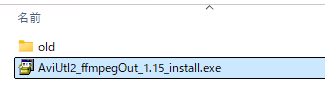

インストールしますか? とでたら [はい] をクリックします。

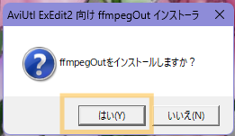

自動的にアーカイブが展開され、インストールが開始されます。


ffmpegOutの動作に必要な追加モジュール(VC runtime)の導入が追加で必要な環境では、ユーザーアカウント制御画面が表示されます。
その場合は、 [はい] をクリックします。
_環境によっては準備が不要な場合があり、その場合は表示されません。_


下記のような画面になり、「ffmpegOut を使用する準備が完了しました。」と出れば終了です。
ウィンドウを閉じ、AviUtl2を起動してffmpegOutが追加されているか確認してください。

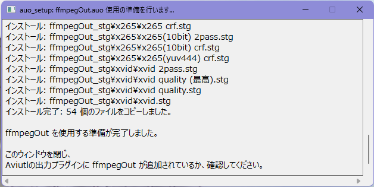

## ffmpegOut の Aviutl への導入・更新

### ダウンロード

まず、ffmpegOutを[こちら](https://github.com/rigaya/ffmpegOut/releases)からダウンロードします。

### 導入・更新

ダウンロードしたzipファイルをダブルクリックして開きます。中身はこんな感じです。

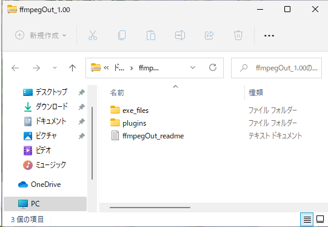

中身をすべてAviutlフォルダにコピーします。

> [!WARNING]
> Aviutl2では、
> - exe_filesフォルダをAviutlフォルダの中に、
> - ```plugins```フォルダの**中身**を全て```C:\ProgramData\aviutl2\Plugin```の中に
>
> それぞれコピーしてください。

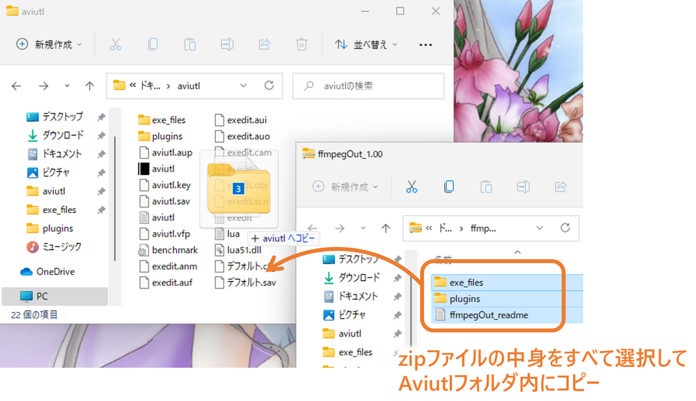

更新時には、下記のように上書きするか聞いてくることがあります。

その場合には「ファイルを置き換える」を選択して上書きしてください。

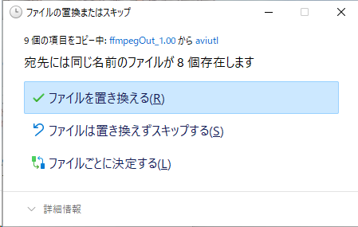
  

次に、ffmpeg本体をダウンロードします。ffmpeg本体は下記サイトからダウンロードすることが可能です。
- [gyan.dev](https://www.gyan.dev/ffmpeg/builds/)
- [BtbN](https://github.com/BtbN/FFmpeg-Builds/releases)

ダウンロードしたffmpeg.exeをAviutlフォルダ内にあるexe_filesフォルダの中にコピーします。

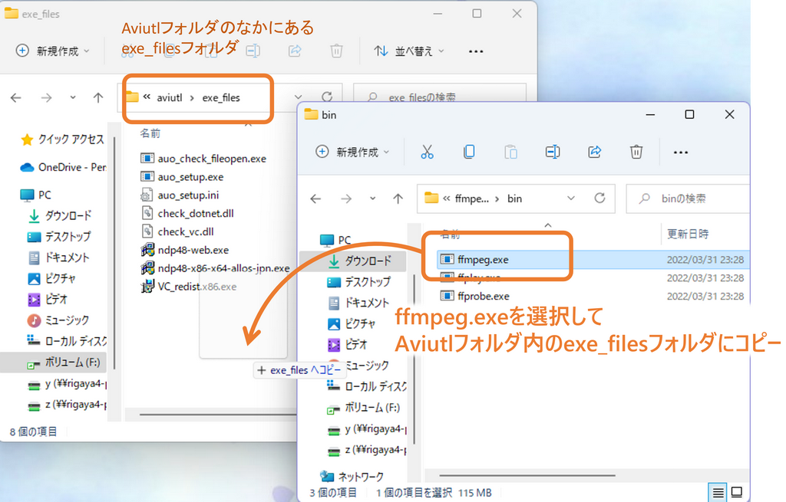
  
このあとAviutlをダブルクリックして起動してください。

初回起動時に必要に応じて下の図のようにffmpegOutの使用準備をするというメッセージが出ます。環境によっては準備が不要な場合があり、その場合は表示されません。

OKをクリックすると使用準備が開始されます。

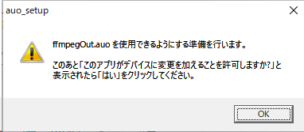
  
  
  
下の図のように、「この不明な発行元からのアプリがデバイスに変更を加えることを許可しますか?」というメッセージが表示されますので、「はい」をクリックしてください。


  
  
  
下の図のようなウィンドウが表示され、ffmpegOutの使用に必要なモジュールがインストールされます。

エラーなくインストールが完了すると下記のように表示されますので、右上の[x]ボタンでウィンドウを閉じてください。

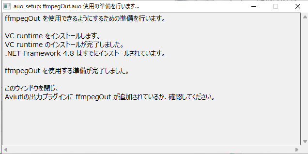

これで使用準備は完了です。

### 確認

ffmpegOutがAviutlに認識されているか確認します。

Aviutlの [その他] > [出力プラグイン情報]を選択します。


ffmpegOut 1.xxが表示されていれば成功です。

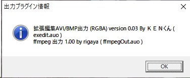


### エンコード
[ ファイル ] > [ プラグイン出力 ] > [ ffmpegOut ] を選択し、出力ファイル名を入力して、「保存」をクリックしてください。

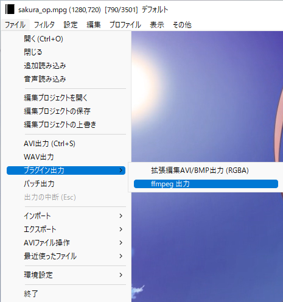

エンコードが開始されます。

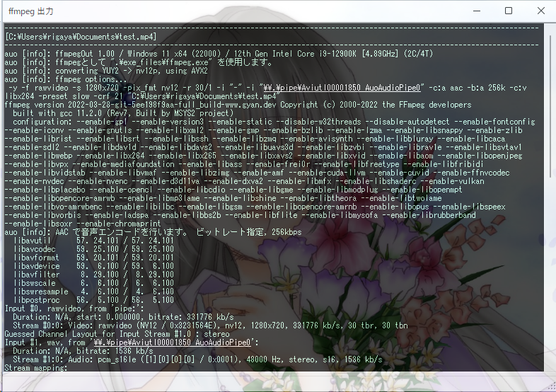

エンコードが完了するまで待ちます。お疲れ様でした。


## iniファイルによる拡張
ffmpegOut.iniを書き換えることにより、音声エンコーダやmuxerのコマンドラインを変更できます。また音声エンコーダを追加することもできます。

デフォルトの設定では不十分だと思った場合は、iniファイルの音声やmuxerのコマンドラインを調整してみてください。

## ffmpegOut の Aviutl からの削除

ffmpegOut の Aviutl から削除するには、"plugins" フォルダ内の下記ファイルとフォルダを削除してください。

- [フォルダ] ffmpegOut_stg
- [ファイル] ffmpegOut.auo
- [ファイル] ffmpegOut.conf (存在する場合のみ)
- [ファイル] ffmpegOut(.ini)
- [ファイル] ffmpegOut.en.(.ini)
- [ファイル] ffmpegOut.zh.(.ini)
- [ファイル] auo_setup.auf

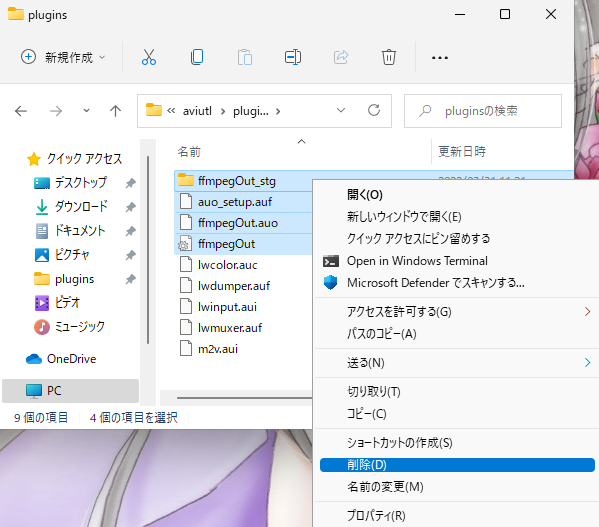


## 処理概要
   
- 通常  
   1) 音声出力
   2) 動画エンコ + 出力した音声を"-i"で読み込み

- 自動2pass時  
   1) 1pass目の動画エンコ + 音声出力 (同時出力)
   2) 2pass目の動画エンコ + 出力した音声を"-i"で読み込み
  

## 設定内容について

- 自動2passエンコード  
  2回エンコードを回し、自動的に2passエンコードを行います。

- 転送色空間  
  ffmpegにどの色空間で映像データを渡すかを決定します。
- インタレ保持  
  fmpegOut.auoでのYUY2→NV12変換でインタレ用を使用するかどうかです。
  インタレ保持エンコを行うためには、この設定だけでなく、ffmpeg側のコマンドにもインタレ保持のコマンドを記述する必要があります。

- 出力拡張子  
  出力ファイルの拡張子を、ここで設定した拡張子に上書き・追加できます。
  ffmpegによるエンコードでは、さまざまな動画をエンコードできるため、設定画面から拡張子を変更できるようにしました。

- エンコーダ優先度  
  ffmpegのCPU優先度の設定です。

- 一時フォルダ  
  エンコ中の動画ファイルの出力位置を変更できます。


## 最終的に渡されるコマンドライン  
 part-A～Gが順番に組み合わさって構成されます。
   
### part-A 入力オプション  
   入力オプション指定欄 に設定したものがそのまま追加されます。

### part-B 映像入力情報  
   パイプで映像データを転送
   -f rawvideo
   -s <width>x<height>
   -pix_fmt <「転送色空間」で設定されたもの>
   -r <fps>
   
### part-C 映像入力(パイプ渡し)  
   -i "-"

### part-D 音声入力 (音声出力が行われ、「音声を有効」にチェックが入っている場合)  
   -i "%{audpath}"
 
### part-E コマンド入力欄  
   改行が削除された後、そのまま追加されます。
   ここで-vcodecや-acodec、さらに-b:v(映像ビットレート)、-b:a(音声ビットレート)を指定してしてください。
 
### part-F 自動2passエンコード] (自動2passが設定された時のみ)  
   -pass x

### part-G 上書きの強制(-y)と出力ファイル名  
   -y
   "%{savpath}"

## 多言語対応

現在、日本語、英語の切り替えに対応しています。

中国語については、Aviutlの中国語対応をされているNsyw様に翻訳いただきました。ご対応いただきありがとうございました！

他の言語については、ffmpegOut.auoと同じフォルダに下記2ファイルを置くことで、新たな言語を追加できます。

| ファイル名 | 翻訳元 |
|:---        |:---   |
| ffmpegOut.<2文字の言語コード>.lng | ffmpegOut.ja.lng |
| ffmpegOut.<2文字の言語コード>.ini | ffmpegOut.ja.ini |

いずれもUTF-8で保存してください。


## ソースコードについて
- MITライセンスです。

### ソースの構成
VCビルド  
文字コード: UTF-8-BOM  
改行: CRLF  
インデント: 空白x4  
